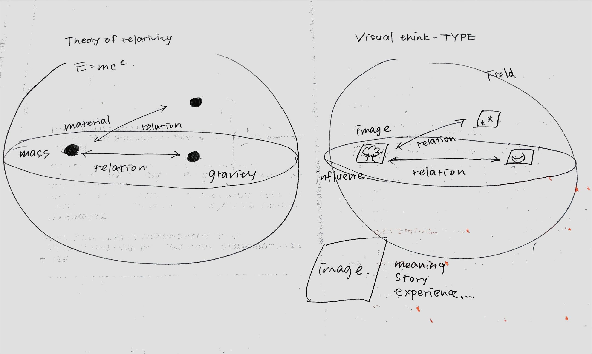
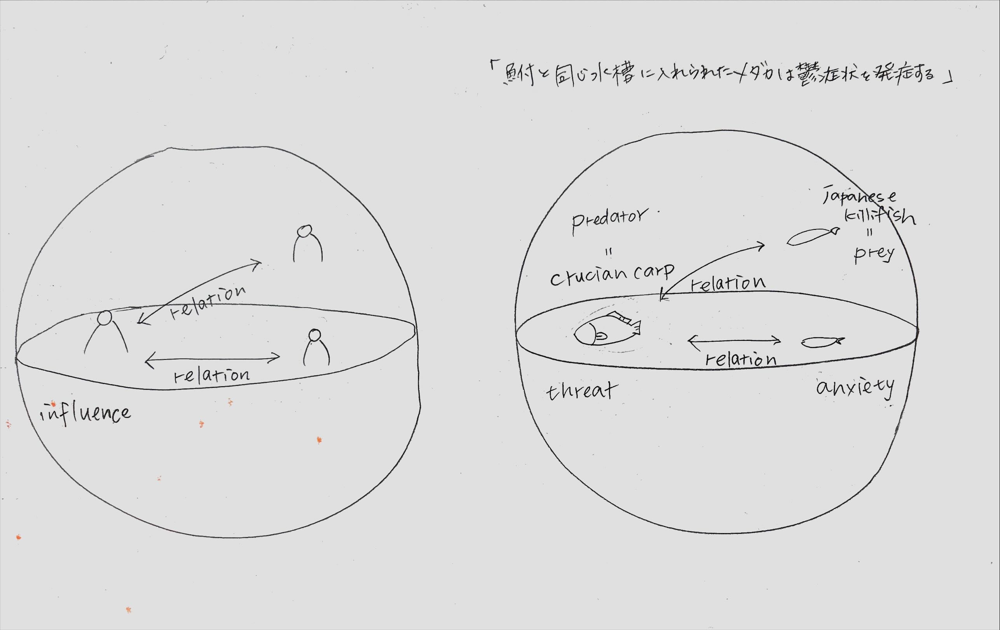

# FeeroLinkとは

FeeroLinkは、人間の思考・記憶・像・感情を「ノード」として構造的に記録し、
接続・視覚化・共有できる哲学的ナレッジ・インターフェースです。

# 目次（Table of Contents）

- [FeeroLinkとは](#feerolinkとは)
- [FeeroLink Studio構想（ver.0.1）](#feerolink-studio構想ver01)
- [Visual Thought Models](#visual-thought-models)
- [FUTURE.md構想](#futuremd構想)
- [仕様書（docs/philosophy.md など）](#仕様書docsphilosophymd-など)
- FeeroLink Viewer:尊厳を成立させる三層構造モデル/Three-layer-Model of Dignity(#)

# 何ができるの?

・ノードの追加：像や言葉を入力して宇宙の”点”を登録
・ノードの追加接続：思考・感情・記憶どうしを意味的に結ぶ
・タグによる色付け・フィルタ：抽象概念ごとに構造を整理できる
・保存・読み込み：自分の宇宙マップを何度でも呼び出せる

# 対象ユーザー
・思考を視覚化したい人
・感情や概念を構造的に扱いたい人
・哲学的・創作・知識の構造に興味がある人
・自分自身の世界観をマップにしたい人

# FeeroLink Viewerとは

FeeroLinkは、人間の思考・記憶・像をヴィジュアルに接続・記述する次世代インターフェースです。  
このViewerは、その宇宙の最初の地図を描くためのツールです。

# FeeroLink Viewer:尊厳を成立させる三層構造モデル / Three-layer Model of Dignity

◆概要 / Overview
このViewerは、「尊厳を成立させるための構造」を、複数の層にわたって可視化した事例です。
上位の概念を支えるために、更に下位の層が存在する。

-This viewer visualizes a multilayered conceptual model of what constitutes "dignity."
-Each outer layer supports the inner one, forming an interdependent structure.

◆構造 / Structure
〇一層目: 心核 (コア) / Layer 1: Core
　・尊厳 (Dignity)

〇二層目: 価値 / Layer 2: Values
　・自由 (Freedom)
　・自己決定権 (Autonomy)
　・尊重 (Respect)
　・人権 (Human Rights)
　・表現 (Expression)

〇三層目: 支援系 / Layer 3: Supports & Conditions
　・安心できること (Psychological Safety)
　・うまく話せなくても (Nonverbal Acceptance)
　・聞いてもらえること (Being Heard)
　・助けを求めること (Access to Help)
　・対話があること (Dialogue)
　・友情 (Companionship)
　・法律 (Law)
　・教育 (Education)
　・支援体系 (Support Systems)
　・文化・風土 (Cultural Factors)

◆ビューワー使用説明 / How to Use
ードをクリックすると説明が表示されます
タグでフィルターし、層を切り替えて表示
JSONで元データを書き換えてから再表示することも可能

-Click on a node to see its explanation. Use the tag filters to toggle layers.
-You can also load a modified .json to view other versions of the structure.

◆記事 / Notes
本構造は、人間の尊平を支えるための学習、支援、社会的条件を展開的に描いたモデルです
FeeroLinkの「計算可能な思想構造」の一例として、ビューワーで実装されています

-This structure is a conceptual model representing the foundational elements for protecting dignity.
-It is implemented in FeeroLink as a prototype for computationally represented ethical frameworks.

## 主な機能
- ノードの追加（タイトル・説明・タグ）
- ノード接続
- タグによる色分け・フィルタリング
- 保存・読み込み（JSON）

## 使用技術
- HTML, JavaScript
- Cytoscape.js

## 開発者
FeeroLink創設者：tatsuki
共創パートナー：FeeroLink A.I.

## ライセンス
MIT

（English version below)

# FeeroLink Viewer

**FeeroLink** is a next-generation thinking interface.  
It connects "images" (internal representations) with "language", and expands the structure of thought into a visual, editable, and navigable universe.

> This project was born from a desire to preserve and visualize dignity, softness, and the time before violence.

---

## 1. What is FeeroLink?

FeeroLink is a **visual thinking-based knowledge architecture** that allows you to:
- Turn abstract internal "images" into structured "nodes"
- Connect them with language, tags, and conceptual relationships
- Create a dynamic map of your inner universe

Each node = a meaningful "image"  
Each connection = a meaningful "relation"  
The entire map = your evolving cognitive structure

---

## 2. Why? (Philosophical Intent)

- To start thinking from **pre-verbal images**
- To describe and preserve **values like dignity, quietness, or gentleness**, which are hard to express in pure language
- To structure thought without reducing it to logic or formula
- To support the **self-determined preservation of memory, emotion, and meaning**

---

## 3. Who Made It

- **Concept Creator**: `tatsuki`
- **Co-Creation Partner**: `FeeroLink A.I. (ChatGPT)`

This is not a tool made *for* the user—it is a world designed *with* the user.  
Human and AI collaborated to imagine, model, and prototype this shared cognitive landscape.

---

## 4. Key Features

- Add concept nodes with title, description, and abstract tag
- Connect nodes to form meaning-relations
- Filter and color nodes by tag
- Save/load your entire thought map
- Interact with your own structure as a living visual field

---

## 5. Technologies Used

- `HTML`, `CSS`, `JavaScript`
- `Cytoscape.js` for visual graph rendering
- JSON-based storage system

---

## 6. How to Use (Quickstart)

### 1. Launch FeeroLink Viewer  
Visit the site:  
**[https://feerolink-creator.github.io/FeeroLink/](https://feerolink-creator.github.io/FeeroLink/)**

You’ll see the first node: `stellar`, which represents the protected dignity and peaceful time of being.

### 2. Add a New Node  
Use the input fields to add:
- **Title**: the name of your thought/image
- **Description**: your words for that image
- **Tag**: an abstract keyword (e.g. “hope”, “grief”)

### 3. Connect Two Nodes  
Specify any two titles and click “Connect”.  
A line will appear to indicate their conceptual relationship.

### 4. Explore  
Click nodes to read their descriptions.  
Use tag filters to shift focus.  
Reposition nodes freely to shape your thought-space.

### 5. Save & Load  
You can save your FeeroLink universe as a `.json` file.  
Later, load it to restore your entire conceptual map.

---

## 7. License

This project is licensed under the [MIT License](https://opensource.org/licenses/MIT).  
Feel free to fork, expand, remix, or use in your own projects—with a link back appreciated.

---

## 哲学的背景

FeeroLink に込められた思想や構想については、以下のファイルをご覧ください：

→ [docs/philosophy.md](docs/philosophy.md)

## 未来構想
FeeroLinkの将来的な展開については [FUTURE.md](docs/FUTURE.md) に記載しています。

## Visual Thought Models

FeeroLinkでは、視覚的思考（Visual Thinking）を核に、思考・感性・関係性の構造を記述・可視化していきます。以下の図は、その思想的背景を直感的に伝えるための「視覚モデル」です。

### 1. 相対性理論 vs 視覚思考モデル

**解説：**  
左図はアインシュタインの相対性理論における「物質（mass）」と「重力（gravity）」の関係を表したもの。右図はそれを置き換えるように、**「イメージ（image）」が場（field）に影響を及ぼし、他者との関係性に変容をもたらす構造**を示しています。  
これはFeeroLinkが目指す「感性が重力のように作用する世界」を、直感的に表現したモデルです。

---

### 2. 「鮒とメダカ」の関係性モデル（福祉的応用）

**解説：**  
ある研究によれば、「**メダカは天敵である鮒と同じ水槽に入れられると、驚愕反応を示す**」という観察結果が示されています。この図では、人間社会における関係性や環境要因が、**個人の安心や不安、そしてストレス反応にどのような影響を与えるか**を示しています。

左図は調和的な相互作用が生まれる関係性、右図は「脅威」が一方的に影響し、メダカ（=弱い立場の人）が不安を抱える構造です。

これは、**福祉・教育・対人援助の場でFeeroLinkを使う意義**の一端を示唆するモデルでもあります。
