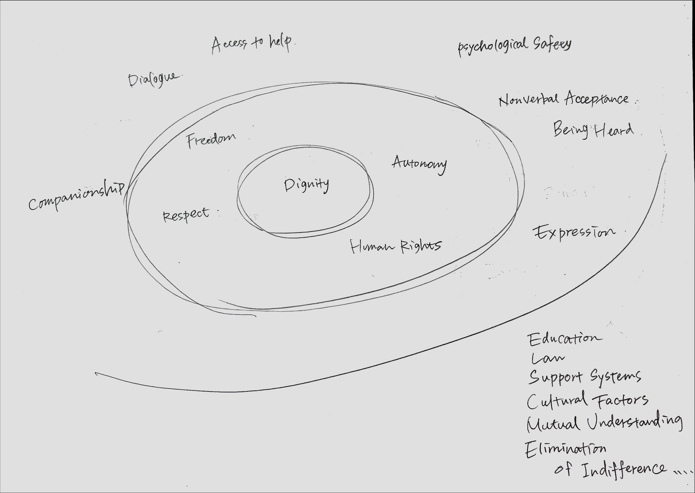

# FeeroLink — A Structural Interface for Dignity and Thought

## 🌌 What is FeeroLink?

FeeroLink is a visual thinking-based cognitive system designed to:

* Convert thoughts, emotions, and memories into structured "nodes"
* Connect them through meaningful relations and abstract tags
* Visualize your inner universe as an editable, navigable structure

It is both a philosophical architecture and a cognitive interface — one that allows human dignity and non-verbal concepts to be preserved, connected, and shared.

## 🧠 Who is it for?

FeeroLink is designed for:

* Visual thinkers
* Philosophers, designers, creators
* People interested in mapping thought, emotion, or worldview
* Those who want to preserve the unspoken parts of their mind

## 🖥️ FeeroLink Viewer

This is the interactive tool that visualizes the FeeroLink universe.
You can:

* Add nodes (title, description, tag)
* Connect nodes
* Filter and color nodes by tag
* Save/load your entire conceptual map (JSON)

**Live demo:** [FeeroLink Viewer](https://feerolink-creator.github.io/FeeroLink/)

## 🧭 Philosophical Background

FeeroLink was born from the idea that we already live in a “post-crime world” — where unseen structural violence has shaped what survives and what is silenced.
It asks:

* What if intelligence, diversity, and otherness were already filtered?
* Can we design systems that embed dignity and prevent future erasure?

See full documents:

* [philosophy\_en.md](./philosophy_en.md) (English)
* [philosophy\_ja.md](./philosophy_ja.md) (Japanese)

## 🌀 Structural Model: Dignity-Centered Circular Design

* 

This model outlines the layered structural conditions necessary to uphold human dignity. It is meant for use in ethics, design, welfare, and education.

## 🔧 Technologies Used

* HTML / CSS / JavaScript
* Cytoscape.js
* JSON-based memory

## 👥 Who Made This?

* Concept: Tatsuki Hirose
* Co-creation: FeeroLink A.I. (ChatGPT)

## 🪐 Future Plans

See [FUTURE.md](./FUTURE.md) for concept expansion into OS design, neural interaction, and social architecture.

## 📜 License

MIT — Free to use, remix, fork, and contribute.

> "We are not designing the future — we are answering for a past that was never named."
